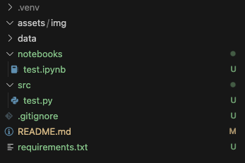

# ntu-msds-sd6125
Repository for SD6125 Data Mining project as part of the Masters in Data Science (NTU)

## Collaboration Structure

Let's observe the following  collaboration structure to ensure that the code repository remains friendly, organised and transparent to all collaborators.

- Do create a branch with your name and add your contributions there. Once you have finished, please make a pull request before merging into the main branch
  - As far as possible, please observe the usual git protocols and workflows while balancing with the ease of contribution
  - No approvers are needed to complete the pull requests, so feel free to merge your own PR into main at your own risk. 
- Files should be organised into their respective subdirectory. For instance, notebooks should be under [notebooks](notebooks)
- Do comment on the code if the code is meant to be shared with others for illustration/descriptive purposes.
- If applicable, please annotate your name at the top of each file so others  can identify who is responsible for which artifacts.


## Project Directory

Files are organised based on the structure below. Feel free to extend the subdirectories (E.g. based on their functionailities/categories etc.) within these folders. Here's a screenshot of how the preliminary project structure looks like. 



- [Notebooks](notebooks): for all notebooks. 
- [Source Scripts](src): for source scripts, either as standalone  Python files, modules or embedded within a Jupyter Notebook.
- [Dependencies](requirements.txt): python dependencies
- [Data](data): data artifacts, includes raw, staging or production data
- [Assets](assets): for other relevant assets such as images, model  files etc.

## src

### Preprocessing

`preprocess_data.py`

Run the following command to execute the preprocessing module. There are 2 arguments available. If no file is given, the module exits.

Preprocessing consist of 3 main steps:
1. read the target dataset from raw directory and applied standardisation
2. perform PCA based on input variance
3. save pca into processed directory

```
# example of executing preprocessing script with file and variance arguments
python3 -m src.preprocessing.preprocess_data --file=1 --variance=0.9

# run with --help flag to see more details on the available arguments
python3 -m src.preprocessing.preprocess_data --help
```

If no argument for file is specified, module exits with the following message.
```
python3 -m src.preprocessing.preprocess_data 

$ No file is given. Module is exiting. Please specify a file for preprocessing
```

## Installation & Usage

Set up environments
``` shell
# linux
python3 -m venv .venv # create venv

source .venv/bin/activate # activate venv

source deactivate # deactivate venv

# windows
python -m venv .venv # create venv

.venv/Scripts/Activate # activate venv

deactivate # deactivate venv
```

Update dependencies
``` shell
# update dependencies
pip freeze > requirements.txt

# install dependencies
pip install -r requirements.txt
```